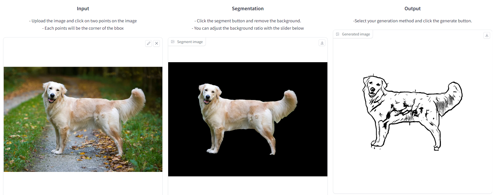

# ColoringBook Generator
- Convert your images to coloring pages



## Getting Started
Requires ```python>=3.8```
```
pip install -requirements.txt
```
### Model checkpoints
Download the model checkpoints, and put them into ./model_checkpoints
- [**AdaIN**](https://github.com/naoto0804/pytorch-AdaIN): [vgg.pth, decoder.pth](https://drive.google.com/drive/folders/1GEb1KGGMdy02wDxu85_IIgNv5cXyQTex)
- [**Segment Anything**](https://github.com/facebookresearch/segment-anything#model-checkpoints): [sam_vit_h_4b8939.pth](https://dl.fbaipublicfiles.com/segment_anything/sam_vit_h_4b8939.pth)

### Demo
Demo UI built with gradio
```
python app_gradio.py
```
- To generate a public link, please add ```--publick_link```
